# Study of image preprocessing steps on scrap metal classification using object detection [Master's Thesis]

## Overview
The large-scale enterprise SMS group has expertise in the metal industry and industrial processes. It is a multinational 
company that values sustainability and social-corporate responsibilities. Consequently, it emphasizes recycling of the 
metal products turned into scraps after consumption.

Scrap-based Electric Arc Furnaces (EAFs) play a vital role in controlling carbon emissions during the steelmaking 
process. The sorted scraps based on their shape, size, and chemical composition are sent to the EAFs for further 
processing. Each EAF operates on different temperatures and other parameters based on the type of scrap used in the EAF.

At present, the steel scraps are sorted manually and sent to different EAFs with the help of
electromagnetic scrap lifter. This process requires trained persons for monitoring and
manual efforts to execute the task. This manual sorting can be automated with the help of computer-vision-based 
techniques.

- **Project Title:** Study of Image Preprocessing Steps on Scrap Metal Classification using YOLOv5 Algorithm
- **Author:** Chirag Vaghela
- **Degree:** Master of Science in Data Engineering
- **Institution:** Jacobs University Bremen
- **Supervisors:** Prof. Dr. Stephan Kettemann, Dr. Christoph Kirmse
- **Collaboration:** SMS digital GmbH, Mönchengladbach

The full PDF version of the thesis can be accessed [here](docs/Masters_Thesis.pdf).

## Problem Statement
This project automates the detection and classification of metal scrap in railway containers through computer vision. 
The implementation uses YOLOv5's small model architecture (YOLOv5s) to 
perform automated detection and classification of metal scrap materials from container top-view imagery. 
The solution streamlines the process of identifying and categorizing different types of steel scrap through 
advanced object detection techniques.

Images captured in scrapyard environments face various quality challenges, including dust, inconsistent lighting, and 
equipment-related issues. These factors can significantly impact model accuracy. Another key focus of this project is 
analyzing how different image preprocessing techniques, applied to the training dataset, affect the model's benchmark 
performance.

## Publication
Co-authored a research paper presented at AISTech 2023. This applied research combined my master’s thesis with an 
industrial-scale project at the SMS group. The solution leveraged YOLOv5 for automated scrap classification using 
real-world scrapyard images. <br/>
🔗 Paper: [Classifications of Scrap Types using Computer Vision algorithms](https://imis.aist.org/AISTPapers/Abstracts_Only_PDF/PR-387-076.pdf) <br/>
📍 Page: 665 | DOI: [10.33313/387/076](https://doi.org/10.33313/387/076) <br/>
🧠 Focus areas: image processing, YOLOv5 tuning, model ensemble, and real time inference <br/>
🏛️ Published by: Association for Iron & Steel Technology (AIST) <br/>

NOTE: The above link provides access to the abstract-only version, but full paper access can be granted upon request.

## Dataset
- Source: Top-view images of railway scrap containers from SMS group facilities.
- Classes:
    - 0: Turnings
    - 1: Rails
- Format: YOLO annotation format using CVAT tool

Turnings sample             |  Rails sample
:--------------------------:|:-------------------------:
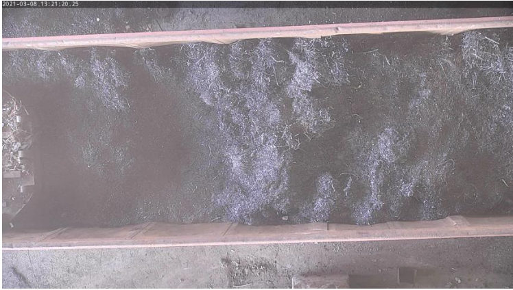  | 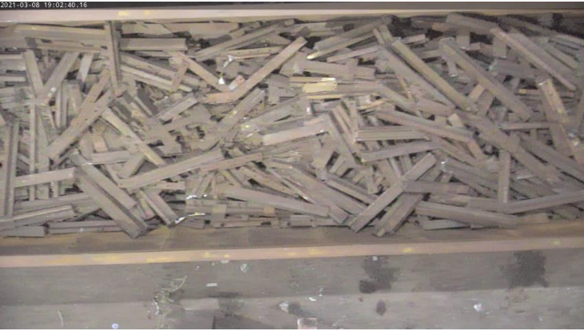

Table 1: comparison of Turnings and Rails scrap type

## Methodology

The application has mainly two phases: 
1. Training of YOLOv5 on a custom image dataset 
2. Inference of scrap types in images

### 1. Training

#### Preprocessing
The train set images are enhanced using image preprocessing operations before model training. There are mainly three 
types of operations chosen for this project: 
(a) augmentation using the Albumentation library 
(b) non-local denoising operation using OpenCV library
(c) Contrast-Limited Adaptive Histogram Equalization (CLAHE) using OpenCV library 

The augmentation is performed on the train set before the start of each epoch during training to generate 
a new train set on each epoch. This resulted in diversified augmented dataset for the model to train upon.
The operations are also performed in combination to generate more diversified copies of the original train set. The 
training of the YOLOv5 algorithm is performed on these augmented and enhanced datasets.

Each training run is executed separately for original dataset and preprocessed datasets as described in the below table.
The algorithm runs mentioned in the below table are studied into three groups to facilitate visualizations of graphs 
and performance parameters.

| Training Run | Group |                Operations performed on training dataset                 |
|:------------:|:-----:|:-----------------------------------------------------------------------:|
|      1       |   -   |                            Original Dataset                             |
|      2       |   1   |          Dataset with only pixel level augmentations performed          |
|      3       |   1   |            Dataset with only spatial augmentations performed            |
|      4       |   1   | Dataset with both pixel level and spatial level augmentations performed |
|      5       |   2   |        Dataset preprocessed with only CLAHE operation performed         |
|      6       |   2   |      Dataset preprocessed with only denoising operation performed       |
|      7       |   2   | Dataset preprocessed with both denoising and CLAHE operations performed |
|      8       |   3   |       Dataset preprocessed with CLAHE operation and augmentations       |
|      9       |   3   |     Dataset preprocessed with denoising operation and augmentations     |
|      10      |   3   |      Dataset preprocessed with denoising, CLAHE, and augmentations      |

Table 2: Operations performed on the train set

The example image with CLAHE operation performed is shown below:

|  Original train set image  | Train set image preprocessed using CLAHE operation |
|:--------------------------:|:--------------------------------------------------:|
| 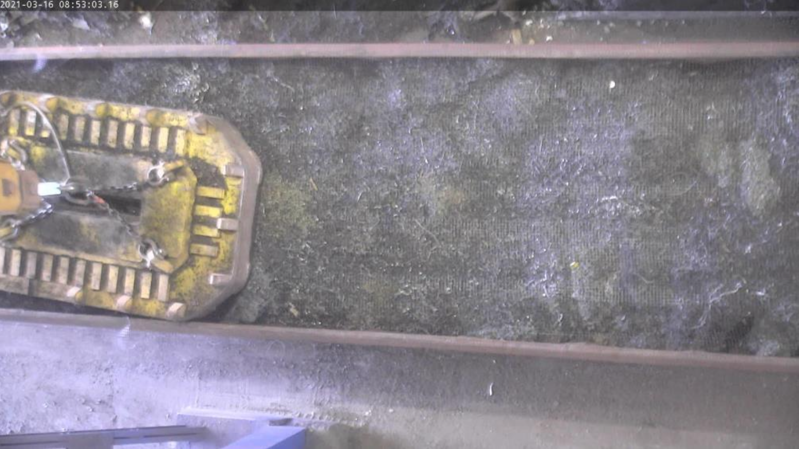 |              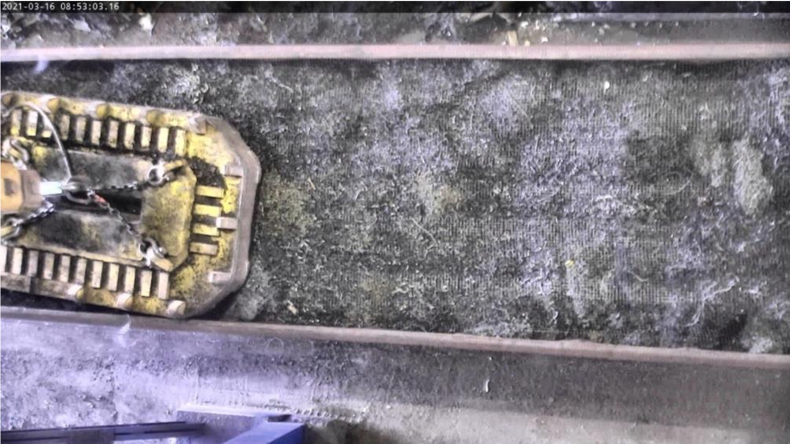               |

Table 3: comparison of original and preprocessed (CLAHE operation) dataset image

#### Annotations
- Tool: Computer Vision Annotation Tool (CVAT) hosted on the on-site server of SMS Group
- Format: YOLO - normalized `(x_center, y_center, width, height)`
- Each image → `.txt` file with 1 line per bounding box:
```
class_id x_center y_center width height
```
- Albumentation library supports annotations for spatial transformation on images

The original train set images are annotated in YOLO format using as shown below:
<br/><br/>
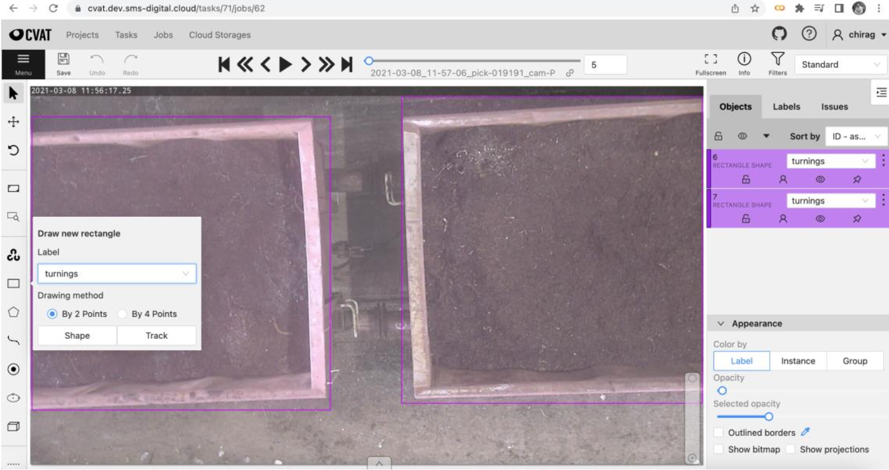
Figure 1: CVAT Interface for image annotation

```
0 0.3 0.48 0.21 0.17
0 0.8 0.42 0.18 0.16
```

The preprocessed training sets are pushed to AWS S3 bucket using DVC. Then the actual training is performed with 
the project instance running on AWS EC2.

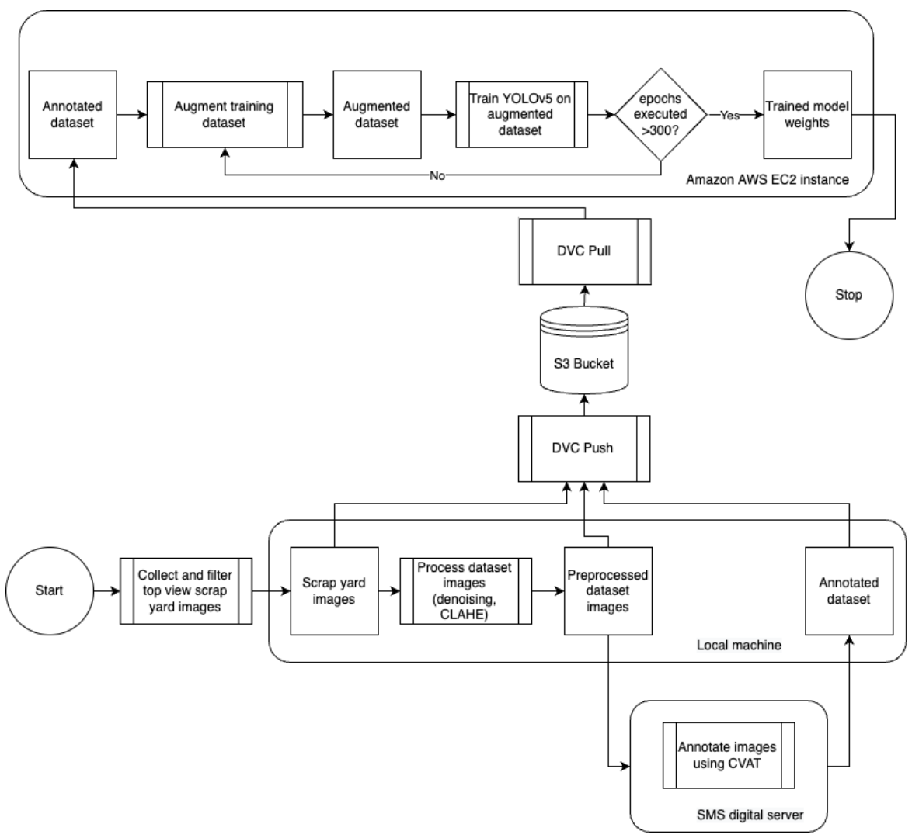 <br/>
Figure 2: Architecture diagram for the training phase

### Training Implementation

- The smallest and fastest base model of YOLOv5 (`YOLOv5s`) was used for training.
- The Python script `train.py` provided officially by YOLOv5 was utilized, along with the `YOLOv5s.pt` weights and 
the `sym.yaml` configuration file, to train the model over 350 epochs.

### 2. Inference

The obtained model weights after each training run are stored in the S3 bucket for future reference. These trained 
model weights are used to perform inference on the test set. The confidence threshold value 0.5 was chosen for 
detection. The results are also saved in text form containing the annotations in addition to predicting bounding 
box, confidence score, and scrap type in images as shown below:

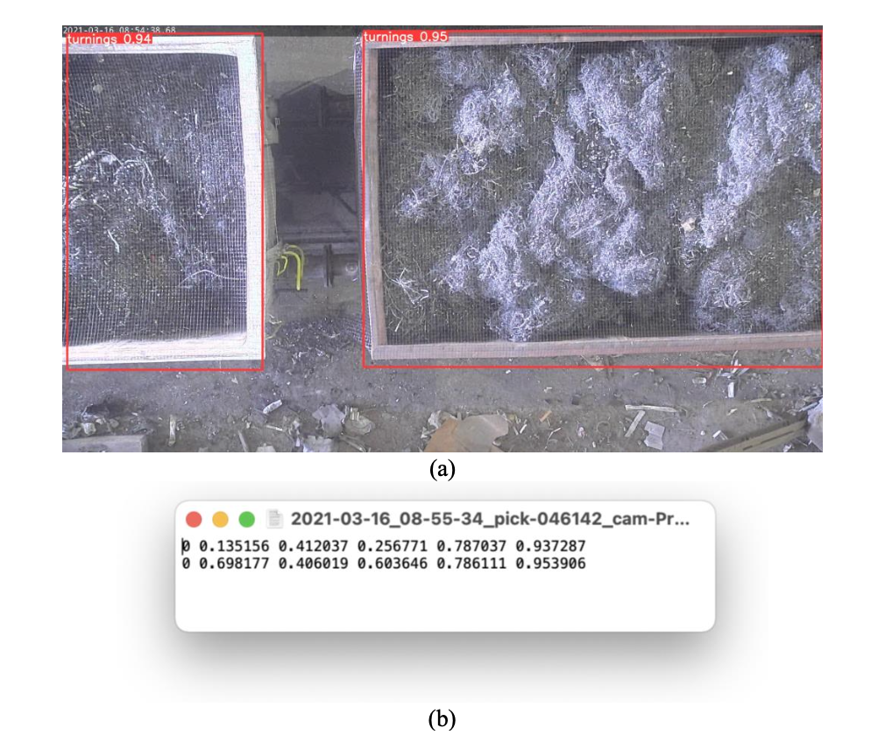
Figure 3: (a) test set image with predicted bounding boxes, scrap type, confidence score (b) text file containing 
labels for the same image

The architecture of the inference phase is shown below: <br/><br/>
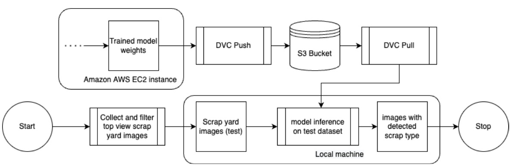 <br/>
Figure 4: Architecture diagram for the inference phase

## Results
The model trained on different train sets produces different results on the test set upon inference. The algorithm runs
are studied in three groups to analyze the effect of augmentation, denoising, and CLAHE operations using *wandb* 
visualization tool.

Predctions on original image      |  Predctions on augmented dataset
:--------------------------------:|:-------------------------:
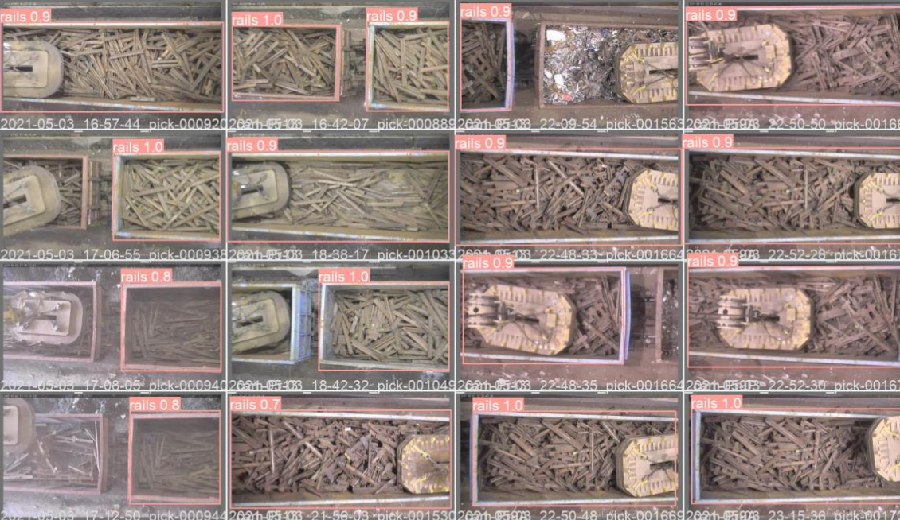   | 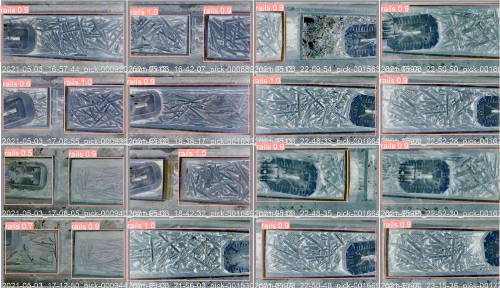

Table 4: model performance comparison trained on original vs augmented dataset

### Model Performance

The performance parameter values for the different group runs are shown in the tables below:

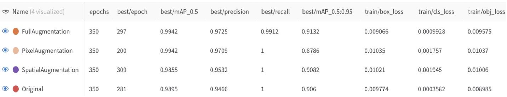
<br/> Figure 5: performance parameter values for group1 runs <br/><br/> 
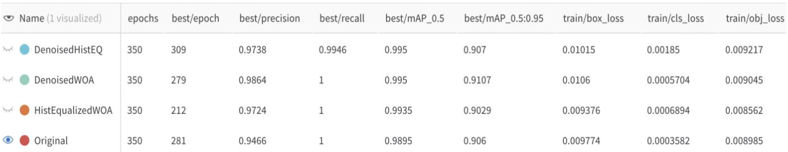
<br/> Figure 6: performance parameter values for group2 runs <br/><br/> 
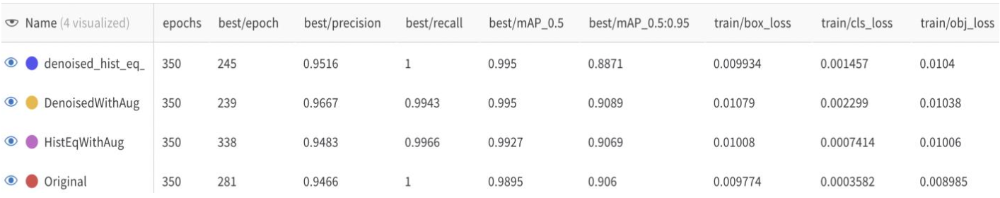
<br/> Figure 7: performance parameter values for group3 runs <br/><br/> 

The confusion matrices for different runs are shown in the below figures: <br/><br/>
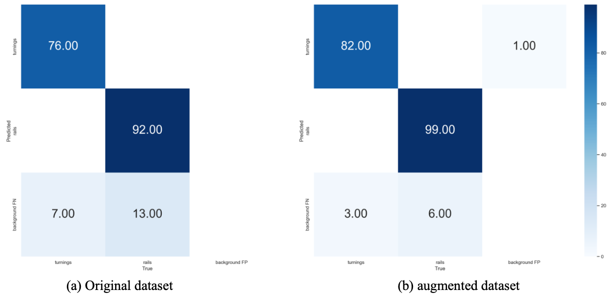
<br/> Figure 8: confusion matrices for group1 runs <br/><br/> 
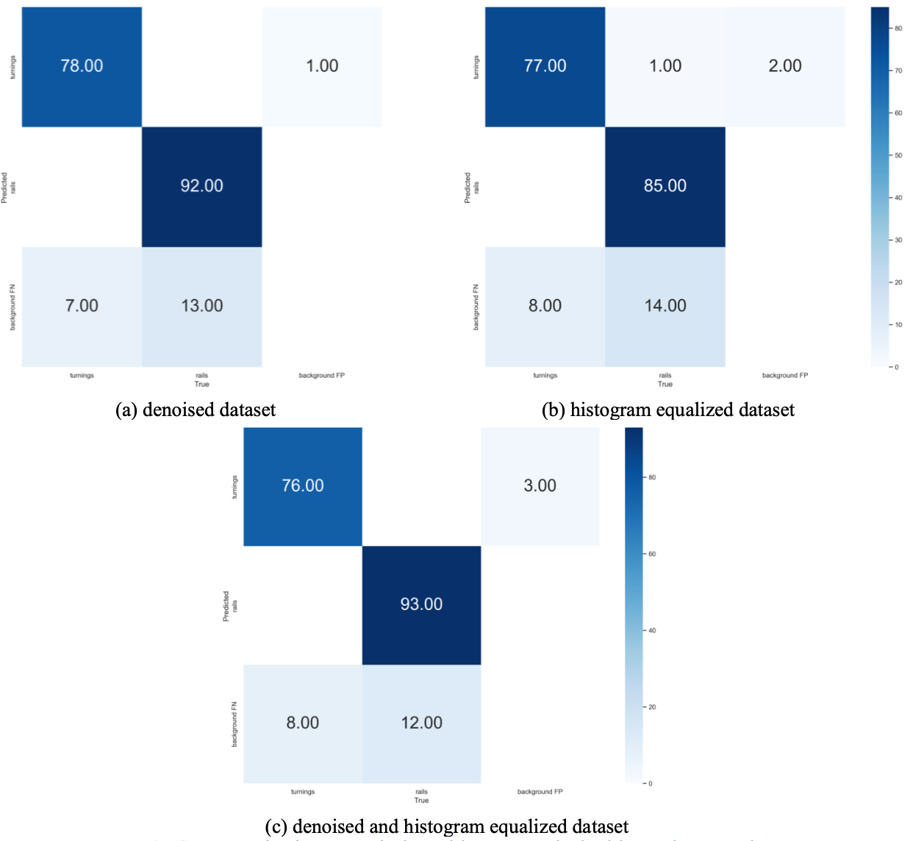
<br/> Figure 9: confusion matrices for group2 runs <br/><br/> 
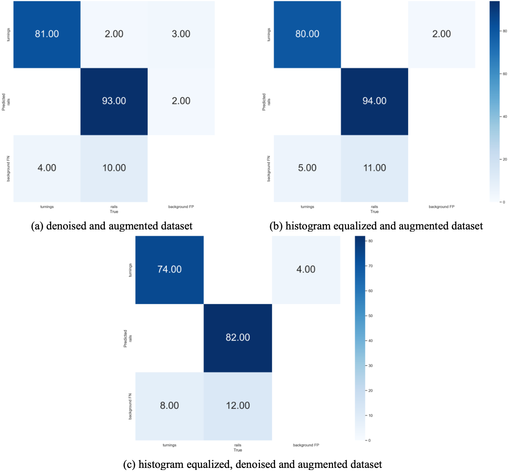
<br/> Figure 10: confusion matrices for group3 runs <br/><br/> 

### Key Findings
- The best mAP<sub>0.5</sub> value of 0.995 is observed with training run 6, 7, 9, and 10 mentioned in table 2 compared 
to mAP<sub>0.5</sub> value of 0.9895 with model trained on original dataset.
- The preprocessing operations caused best epoch to shift to lower values and allowed model for early stopping in 
some cases, i.e., training run 9 to conclude faster convergence.
- The average confidence value was calculated for TP cases of detected scrap types for each run using a custom 
Python script. The average confidence value is plotted for each run as shown in the below figure. The green line shows 
the benchmarking average confidence value for the algorithm trained on the original dataset.

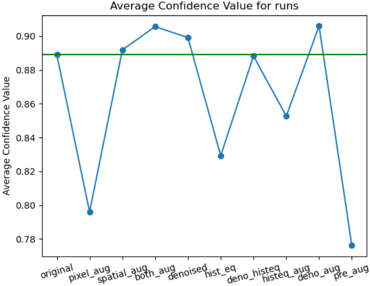

Figure 11: Average confidence score for each run

## Installation
```bash
# Clone and install dependencies
git clone https://github.com/ChiragVaghela10/automated_metal_scrap_classification
cd automated_metal_scrap_classification
pip install -r requirements.txt

# Train YOLOv5
python train.py --data data/sym.yaml --weights models/yolov5s.pt --epochs 350

# Run inference
python detect.py --weights models/best.pt --source data/sym_data/scrap/

```

## About Me
For queries or collaboration opportunities, feel free to reach out: 
<br/> 📧 Email: chiragvaghela10@ymail.com
<br/> 💼 LinkedIn: https://www.linkedin.com/in/chiragvaghela/
