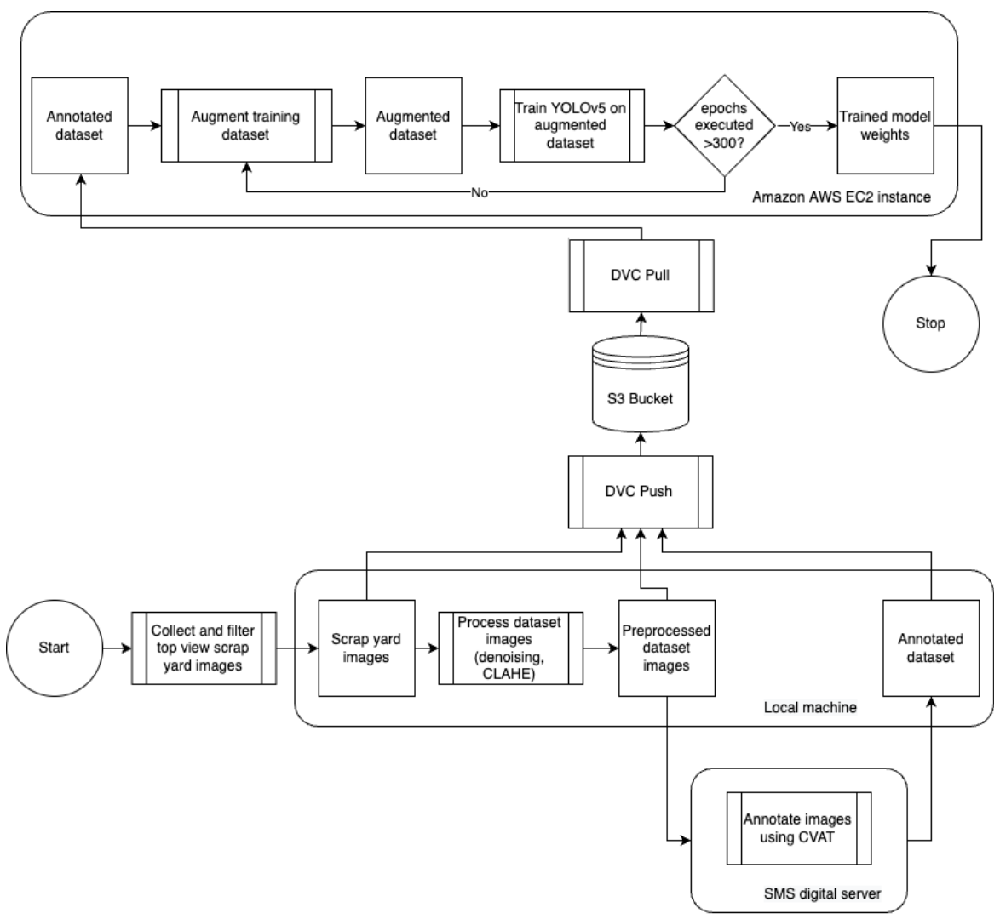

# Study of image preprocessing steps on scrap metal classification using object detection [Master's Thesis]

## Overview
The large-scale enterprise SMS group has expertise in the metal industry and industrial processes. It is a multinational 
company that values sustainability and social-corporate responsibilities. Consequently, it emphasizes recycling of the 
metal products turned into scraps after consumption.

Scrap-based Electric Arc Furnaces (EAFs) play a vital role in controlling carbon emissions during the steelmaking 
process. The sorted scraps based on their shape, size, and chemical composition are sent to the EAFs for further 
processing. Each EAF operates on different temperatures and other parameters based on the type of scrap used in the EAF.

At present, the steel scraps are sorted manually and sent to different EAFs with the help of
electromagnetic scrap lifter. This process requires trained persons for monitoring and
manual efforts to execute the task. This manual sorting can be automated with the help of computer-vision-based 
techniques.

## Problem Statement
This project automates the detection and classification of metal scrap in railway containers through computer vision. 
The implementation uses YOLOv5's small model architecture (YOLOv5s) to 
perform automated detection and classification of metal scrap materials from container top-view imagery. 
The solution streamlines the process of identifying and categorizing different types of steel scrap through 
advanced object detection techniques.

Images captured in scrapyard environments face various quality challenges, including dust, inconsistent lighting, and 
equipment-related issues. These factors can significantly impact model accuracy. Another key focus of this project is 
analyzing how different image preprocessing techniques, applied to the training dataset, affect the model's benchmark 
performance.

## Dataset
While the dataset contains multiple types of metal scrap, this project specifically focuses on classifying two 
categories: 'Turnings' and 'Rails', as illustrated below:

Turnings sample             |  Rails sample
:--------------------------:|:-------------------------:
  | 

## Project Architecture

 <br/>
Fig (a): Project architecture for the training phase

 <br/>
Fig (b): Project architecture for the inference phase

<project structure>

<project architecture diagrams>

<cvat and other stuffs>

<train/val loss diagrams>

...

<details open>
<summary>Install</summary>

Clone repo and install [requirements.txt](https://github.com/ultralytics/yolov5/blob/master/requirements.txt) in a
[**Python>=3.7.0**](https://www.python.org/) environment, including
[**PyTorch>=1.7**](https://pytorch.org/get-started/locally/).

```bash
git clone https://github.com/ultralytics/yolov5  # clone
cd yolov5
pip install -r requirements.txt  # install
```

</details>
